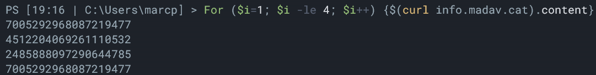
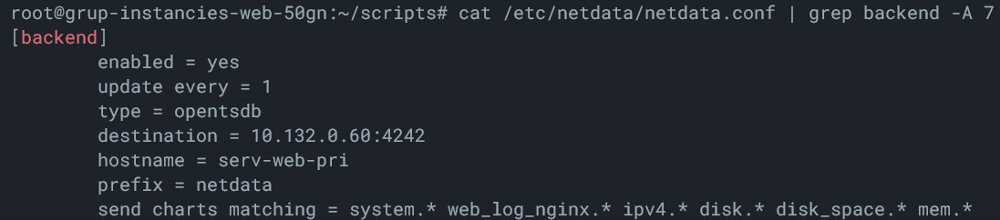
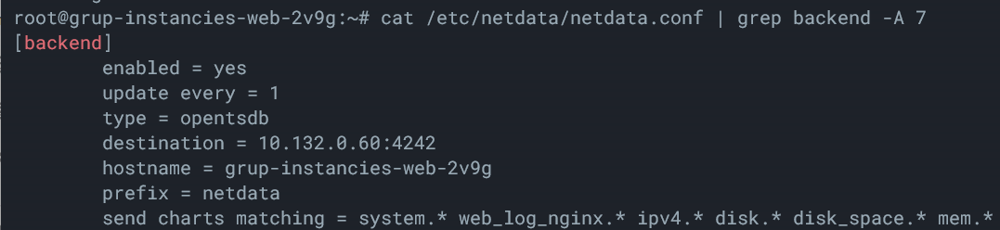

# Scripts de serveis
Aquestos scripts s'han pensat per executarse en un entorn de google variable, per lo que si la maquina que executa el codi te un hostname o un id diferent, s'adaptara.

## Script de identificacio d'instancia
Aquest script mostra el identificador de instancia. La seva funcio es comprobar que el balanceigador de carrega funciona correctament. Si accedim a una web que es hospedada en instancies de google rere un balanceig de carrega, amb aquest script podem veure el ID de la instancia.

```
#!/bin/bash
curl -H Metadata-Flavor:Google http://metadata/computeMetadata/v1/instance/id -o /var/www/info/index.html
chown www-data /var/www/info/index.html
```

Si executem peticions web, podem comprobar que el id de la maquina canvia.




## Script de hostname en monitoritzacio
Aquest script canvia el hostname de la configuracio de Netdata. Aixo ens permet que tinguem maquines "dinamiques" que aixeca un grup d'instancies a Google Cloud, i tenir identificador de cadascuna sense haver de fer-ho manualment.

```
hostname=$(curl -H Metadata-Flavor:Google http://metadata/computeMetadata/v1/instance/name)
sed -i "s/serv-web-pri/$hostname/" /etc/netdata/netdata.conf
systemctl start netdata
```

Agafem de les metadades de Google el nom de la maquina i el guardem en una variable.
El funcionament d'aquest script canvia el text (si existeix) "serv-web-pri" per la variable que hem guardat avans.
I finalment iniciem el servei de Netdata que previament estaba "deshabilitat".

Configuracio avans



Configuracio despres

